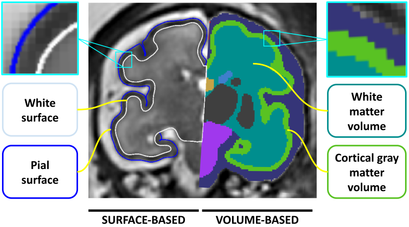
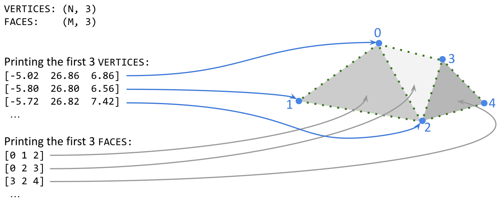
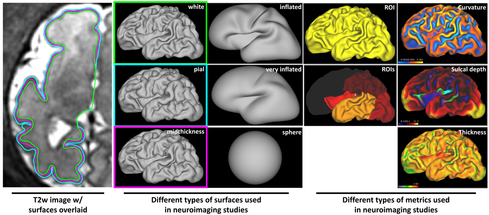

# From Voxels to Vertices: Exploring and Checking Cortical Surfaces

[← Back to all tutorials](../README.md)

## Overview

This tutorial introduces cortical surfaces: what they represent, how they
are stored, and why they are useful in neuroimaging. You will explore
surfaces using Connectome Workbench and learn to recognise common
reconstruction errors.

## Before You Start

You will need:

- Connectome Workbench installed.
- The tutorial dataset downloaded.
- A terminal and basic familiarity with navigating directories.

## Contents

1. [What Is a Cortical Surface?](#1-what-is-a-cortical-surface)
2. [Why Use Surfaces?](#2-why-use-surfaces)
3. [How Are Surfaces Represented?](#3-how-are-surfaces-represented)
4. [Exploring Surfaces in Connectome Workbench](#4-exploring-surfaces-in-connectome-workbench)
5. [Checking Surface Quality](#5-checking-surface-quality)
6. [From Individual Surfaces to Group Analysis](#6-from-individual-surfaces-to-group-analysis)
7. [Further Reading](#7-further-reading)

## 1. What Is a Cortical Surface?

A cortical surface is a 3D representation of a boundary of the cerebral cortex. 
Unlike an MRI volume, which represents the brain as a grid of voxels, a surface follows that boundary using a mesh of interconnected points.

Two commonly reconstructed cortical boundaries are:
- **White matter** surface: the boundary between cortical grey matter and the underlying white matter.
- **Pial** surface: the outer boundary of the cortex, adjacent to cerebrospinal fluid.

Together, these surfaces describe the cortical ribbon: the layer of cortical grey matter between them.

## 2. Why Use Surfaces?

The cortex is a thin, highly folded sheet. Surface representations let us
study its geometry and organise measurements along that sheet.

For example, two locations on opposite banks of a sulcus can be close
together in three-dimensional space but far apart when travelling along
the cortex. Surface-based methods can account for this distinction by
using the mesh connectivity.

Surfaces are useful for:

- **Measuring cortical anatomy:** including thickness, surface area,
  curvature, and sulcal depth.
- **Visualising measurements:** displaying anatomical or functional maps
  on the cortex.
- **Comparing subjects:** aligning cortical features to establish
  correspondence across brains.
- **Studying development:** examining changes in cortical shape and
  folding with age.

These benefits depend on reconstruction quality: a surface that follows
the wrong boundary can produce misleading measurements.

## 3. How Are Surfaces Represented?

### Surface and Volume Meshes

A mesh represents the geometry of an object using connected points and
elements. There are two main types:

- **Surface meshes** describe an object's boundary using two-dimensional
  polygons, usually triangles, embedded in three-dimensional space.
- **Volume meshes** represent an object's interior using three-dimensional
  elements, such as tetrahedra or hexahedra.

In this tutorial, we focus on **triangular surface meshes** representing 
the boundaries of each cerebral hemisphere.
These cortical meshes are typically constructed as closed surfaces
topologically equivalent to a sphere: they have no open edges, holes,
or handles. 
This describes their connectivity, not their appearance: a folded cortical
surface can have the same topology as a sphere.

### Vertices and Triangular Faces

A triangular surface mesh has two main components:

- **Vertices:** points defined by three-dimensional `(x, y, z)` coordinates.
- **Faces:** triangles defined by the indices of three connected vertices.

For a mesh with **N vertices** and **M faces**, the geometry is stored as:

- An **N × 3 coordinate array**, containing the position of each vertex.
- An **M × 3 index array**, identifying the vertices that form each triangle.

For example, a face containing the indices `(0, 1, 2)` connects vertices
0, 1, and 2 to form a triangle.

The vertex coordinates determine the surface's shape, while the faces
determine its connectivity. Changing the coordinates while keeping the
faces fixed deforms the mesh without changing which vertices are connected.

### Surface Representations and Vertex-Wise Data

The shape of a surface and the data displayed on it are different types
of information. The figure below shows examples of both.

#### Surface Geometry

Different surface geometries serve different purposes:

- **White matter:** follows the boundary between cortical grey matter
  and the underlying white matter.
- **Pial:** follows the outer cortical boundary, adjacent to
  cerebrospinal fluid.
- **Midthickness:** lies approximately halfway between corresponding
  white matter and pial surfaces.
- **Inflated and very inflated:** progressively open out the folds,
  making regions buried within sulci easier to inspect.
- **Sphere:** provides a spherical representation commonly used for
  surface registration.

Inflated and spherical representations change the vertex coordinates
while preserving the mesh connectivity. Their displayed shapes do not
represent the original anatomical boundaries.

#### Vertex-Wise Maps

Measurements or labels can be attached to individual vertices and
displayed as colours on a surface:

- **Sulcal depth:** describes how deeply a location lies within the
  cortical folds relative to a reference surface.
- **Curvature:** describes local bending of the surface.
- **Thickness:** estimates the distance between the white matter and
  pial boundaries.
- **Regions of interest (ROIs):** assign vertices to anatomical or
  other defined regions.

The definitions and sign conventions of these measurements depend on
the processing method. Always check the colour scale and the method
used to generate a map.

#### File Types

Surface geometry and vertex-wise data are commonly stored in separate
files:

| File type | Typical contents |
|---|---|
| `.surf.gii` | Vertex coordinates and triangular faces |
| `.shape.gii` or `.func.gii` | Numeric values associated with vertices |
| `.label.gii` | Anatomical or other categorical labels associated with vertices |

A vertex-wise map must match the surface's vertex ordering and
correspondence. Two files having the same number of vertices does not
guarantee that they belong together.

## 4. Exploring Surfaces in Connectome Workbench

## 5. Checking Surface Quality

## 6. From Individual Surfaces to Group Analysis

## 7. Further Reading

--- 

## 👥 Authors
*   **Irina Grigorescu** 

*Last Updated: October 2026*
