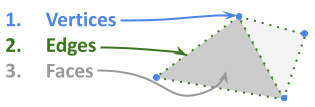

# From Voxels to Vertices: Exploring and Checking Cortical Surfaces

[← Back to all tutorials](../README.md)

## Overview

This tutorial introduces cortical surfaces: what they represent, how they
are stored, and why they are useful in neuroimaging. You will explore
surfaces using Connectome Workbench and learn to recognise common
reconstruction errors.

## Before You Start

You will need:

- Connectome Workbench installed.
- The tutorial dataset downloaded.
- A terminal and basic familiarity with navigating directories.

## Contents

1. [What Is a Cortical Surface?](#1-what-is-a-cortical-surface)
2. [Why Use Surfaces?](#2-why-use-surfaces)
3. [How Are Surfaces Represented?](#3-how-are-surfaces-represented)
4. [Exploring Surfaces in Connectome Workbench](#4-exploring-surfaces-in-connectome-workbench)
5. [Checking Surface Quality](#5-checking-surface-quality)
6. [From Individual Surfaces to Group Analysis](#6-from-individual-surfaces-to-group-analysis)
7. [Further Reading](#7-further-reading)

## 1. What Is a Cortical Surface?

A mesh is a digital framework that defines the the geometric structure of a 3D object.

*Figure 1. The elements of a mesh.*

## 2. Why Use Surfaces?

## 3. How Are Surfaces Represented?

## 4. Exploring Surfaces in Connectome Workbench

## 5. Checking Surface Quality

## 6. From Individual Surfaces to Group Analysis

## 7. Further Reading

--- 

## 👥 Authors
*   **Irina Grigorescu** 

*Last Updated: October 2026*
